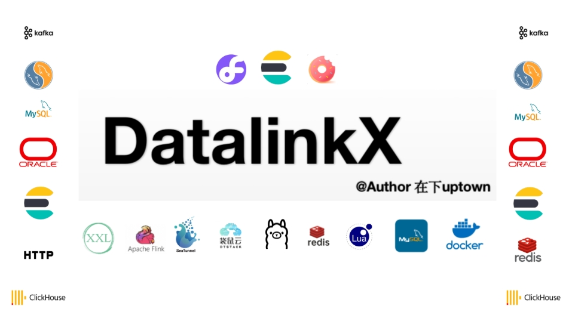
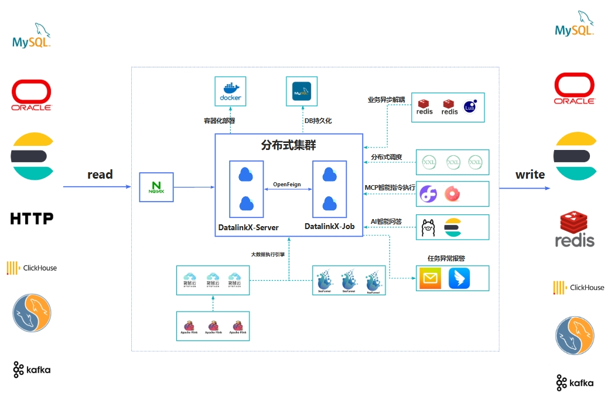
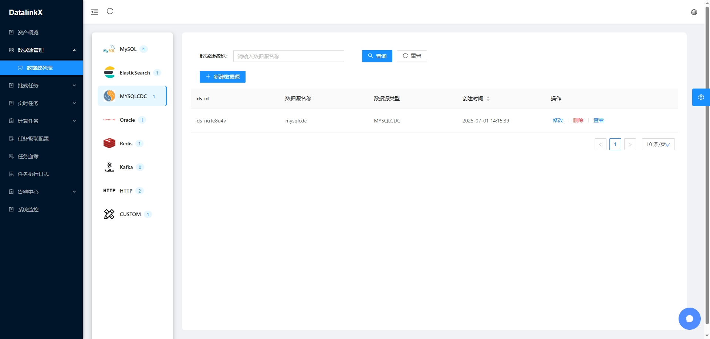
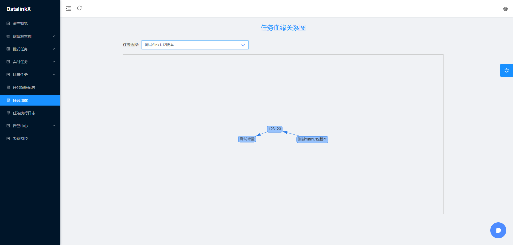

## [企业版尽在DatalinkX-Pro](https://note.youdao.com/s/a9ltzlc1)
- 更完善的户权限体系
- 更丰富的数据库插件支持
- 5*24小时技术支持
- 定制化需求承接

## DatalinkX Stars

  
  
  
  
  
  
  
  
  
  
  

🔥🔥 **10W+字，共92个文档，带你玩转datalinkx**，详情可戳：[细致文档带你吃透DatalinkX](https://share.note.youdao.com/s/6pPwe3oT)
## 异构数据源同步服务DatalinkX介绍

 **核心功能** ：在不同的异构数据源中进行数据同步，对同步任务进行管理和维护

 **意义**：只要公司规模较大，部门与部门之间有数据协作都应该有类似DatalinkX的项目，比如爬虫组的同事爬下来数据要定时同步到数仓组负责的库下。同步服务会集中管理同步任务，收拢同步日志、提高内部工作效率。

## 项目特性

- **简单易用**：通过Web页面快速创建数据源、同步任务，操作简单，一分钟上手
- **定时触发**：对接xxl-job定时，设置cron表达式触发同步任务
- **配置化任务对接**：将数据库信息、任务详情界面化配置
- **高性能同步**：使用高性能流式flink、seatunnel计算引擎
- **支持插件化加载数据源**：支持自定义数据源，按照固定规则开发driver放入统计driver-dist中即可使用
- **容器化部署**：支持docker部署

## 项目地址

| 项目   | GITEE                                       | GITHUB                                          | GITCODE                                       |
|------|---------------------------------------------|-------------------------------------------------|-----------------------------------------------|
| 项目地址 | [GITEE](https://gitee.com/atuptown/datalinkx)  | [GITHUB](https://github.com/SplitfireUptown/datalinkx)    | [GITCODE](https://gitcode.com/m0_37817220/datalinkx) |

## 项目技术栈
| 依赖					            | 版本					         |描述
|--------------------|-----------------|-------
| Spring Boot			     | 2.7.15					      |项目脚手架
| SpringData JPA			  | 2.7.15					      |持久层框架
| MySQL					         | 8.0					        |DB数据库
| ElasticSearch					 | 7.9.3					      |向量库、支持流转的数据库
| Redis					         | 5.0 ↑					      |缓存数据库
| RedisStream					   | 5.0 ↑					      |消息中间件
| ChunJun(原FlinkX)		 | 1.10_release			 |袋鼠云开源数据同步框架
| Seatunnel		        | 2.3.8			        |apache开源数据同步框架
| Flink					         | 1.10.3					     |分布式大数据计算引擎
| Ollama					        | x					          |大模型执行框架
| Solon					         | 3.3.1				          |MCP框架
| Xxl-job				        | 2.3.0					      |分布式调度框架
| OpenFeign				      | 3.1.9					      |RPC通信服务
| Jackson				        | 2.11.4					     |反序列化框架
| Maven					         | 3.6.X					      |Java包管理
| Vue.js					        | 2.X					        |前端框架
| AntDesignUI			     | 3.0.4					      |前端UI
| Docker					        | 					           |容器化部署

## 使用姿势

1. 登录系统，默认密码admin、admin登录，没有权限相关控制

2. 数据源管理，配置数据流转数据源信息

3. 任务管理
   1. 批式任务：配置from_db与to_db构造job_graph
   
   2. 实时任务：配置from_db与to_db构造job_graph，仅支持kafka
   
   3. 计算任务: 配置画布信息，支持transform算子操作
   
5. 任务级联配置

6. 任务血缘

6. 任务调度

7. 任务执行

## 项目文档
[细致文档带你吃透DatalinkX](https://share.note.youdao.com/s/6pPwe3oT)